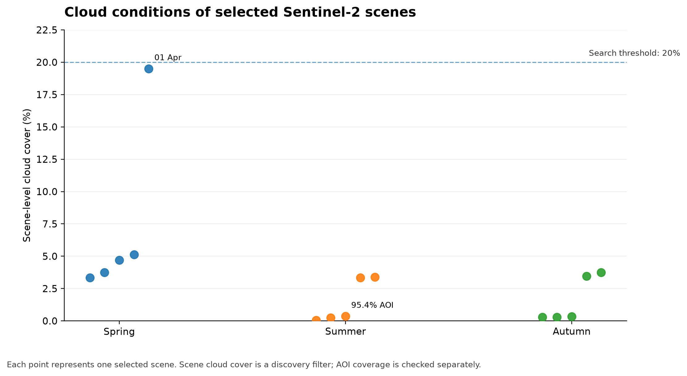

# Stage 1 Data Discovery Report

> **Purpose.** Confirm study-area geometry, identify suitable Sentinel-2 observations, and verify the reference-label source before raster preprocessing or model training.

## QA at a glance

| Check | Result |
|---|---:|
| Augsburg municipal area | **146.76 km²** |
| Sentinel-2 candidate scenes | **51** |
| Selected scenes | **15** |
| Scene cloud-cover search threshold | **<20%** |
| Minimum target AOI coverage | **95%** |
| WorldCover source check | **HTTP 206** |

## Seasonal scene summary

| Season | Candidates | Selected | Cloud cover range | AOI coverage range |
|---|---:|---:|---:|---:|
| Spring | 15 | 5 | 3.3–19.5% | 100.0–100.0% |
| Summer | 17 | 5 | 0.1–3.4% | 95.4–100.0% |
| Autumn | 19 | 5 | 0.3–3.8% | 100.0–100.0% |

## Study area

- Boundary: OpenStreetMap relation **62407**.
- Municipal area: **146.76 km²**.
- CRS used for metric area and coverage checks: **EPSG:32632**.

## Selected-scene details

The main report keeps scene-level metadata collapsed. Expand a season when exact acquisition times, cloud-cover values, AOI coverage, or STAC item IDs are needed.

<strong>Spring</strong> — 5 selected scene(s)

| Acquisition | Cloud cover | AOI coverage | STAC item |
|---|---:|---:|---|
| 2021-03-02 10:27 UTC | 3.3% | 100.0% | `S2B_32UPU_20210302_1_L2A` |
| 2021-03-02 10:27 UTC | 5.1% | 100.0% | `S2B_32UPU_20210302_0_L2A` |
| 2021-04-01 10:27 UTC | 19.5% | 100.0% | `S2B_32UPU_20210401_0_L2A` |
| 2021-05-31 10:27 UTC | 3.7% | 100.0% | `S2B_32UPU_20210531_0_L2A` |
| 2021-05-31 10:27 UTC | 4.7% | 100.0% | `S2B_32UPU_20210531_1_L2A` |

<strong>Summer</strong> — 5 selected scene(s)

| Acquisition | Cloud cover | AOI coverage | STAC item |
|---|---:|---:|---|
| 2021-06-17 10:17 UTC | 0.4% | 95.4% | `S2B_32UPU_20210617_0_L2A` |
| 2021-07-30 10:27 UTC | 3.4% | 100.0% | `S2B_32UPU_20210730_0_L2A` |
| 2021-07-30 10:27 UTC | 3.3% | 100.0% | `S2B_32UPU_20210730_1_L2A` |
| 2021-08-14 10:27 UTC | 0.1% | 100.0% | `S2A_32UPU_20210814_1_L2A` |
| 2021-08-14 10:27 UTC | 0.3% | 100.0% | `S2A_32UPU_20210814_0_L2A` |

<strong>Autumn</strong> — 5 selected scene(s)

| Acquisition | Cloud cover | AOI coverage | STAC item |
|---|---:|---:|---|
| 2021-09-03 10:27 UTC | 0.3% | 100.0% | `S2A_32UPU_20210903_2_L2A` |
| 2021-09-03 10:27 UTC | 0.3% | 100.0% | `S2A_32UPU_20210903_1_L2A` |
| 2021-09-03 10:27 UTC | 0.3% | 100.0% | `S2A_32UPU_20210903_0_L2A` |
| 2021-09-08 10:27 UTC | 3.5% | 100.0% | `S2B_32UPU_20210908_1_L2A` |
| 2021-09-18 10:27 UTC | 3.8% | 100.0% | `S2B_32UPU_20210918_0_L2A` |

## QA notes

- **Coverage check:** 1 selected scene(s) provide less than 99% AOI coverage; these should be inspected during compositing.
- **Cloud check:** 1 selected scene(s) have scene-level cloud cover of 10% or more. Pixel-level SCL masking remains necessary.

## Reference labels

- Product: **ESA WorldCover 2021 v200**.
- Tile: **N48E009**.
- Source check: **HTTP 206**.

> **Important limitation:** WorldCover is a reproducible reference-label layer, not independent field truth. Agreement with WorldCover must not be presented as independent real-world classification accuracy.

## Stage 1 decision

Stage 1 is a data-quality gate. The selected scenes should be reviewed before classifier training.

**Next step:** load the selected Sentinel-2 assets, apply Scene Classification Layer (SCL) masking, align bands to 10 m, and build seasonal composites.